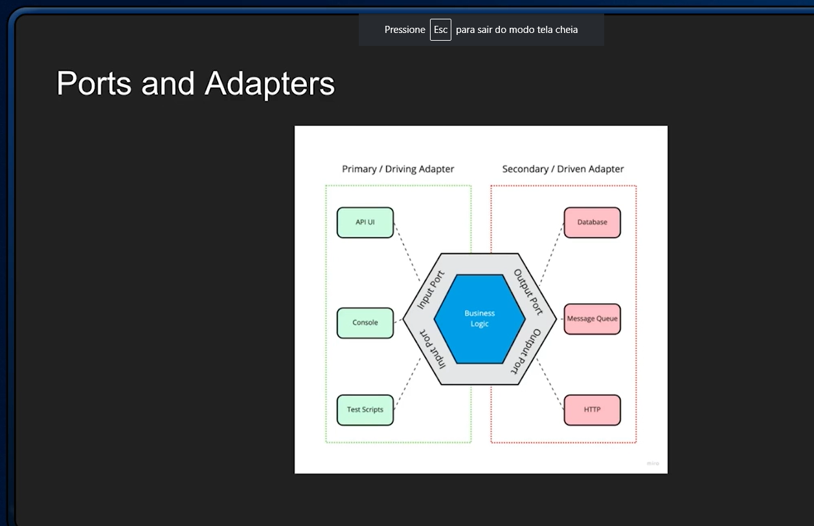
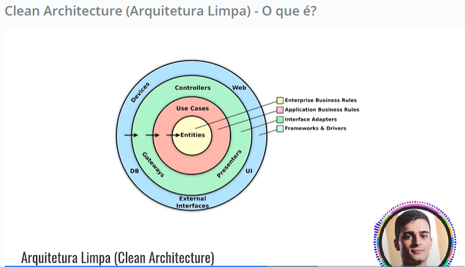
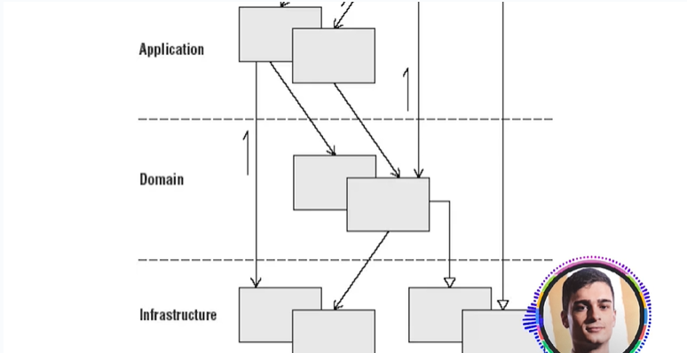
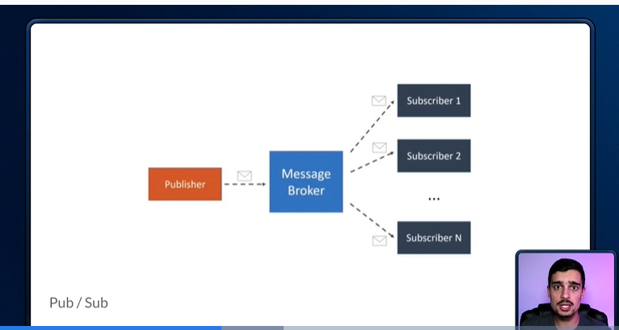

# Tópicos sobre Design e Arquitetura

## Design de código x arquitetura de software

- Definição de arquitetura de software: Visão de mais alto nível. Separação de camadas, pastas da aplicação.

- Definição de design de código: Visão de mais baixo nível. Como escrever cada classe. Quais padrões aplicar (DDD, SOLID, KISS, DRY).

## Clean Architecture

- O que é arquitetura de software? É a definição dos componentes, suas propriedades externas e seus relacionamentos com outros softwares.

- Um modelo de organização é o MVC (MODEL, VIEW e CONTROLLER).

- Clean Architecture:

    

## Arquitetura hexagonal

- Ports and Adapters ou Arquitetura Hexagonal tem a ideia de isolar toda a regra de negócio.

- Arquitetura hexagonal:

    

## DDD (Domain Drive Design)

- Design de código orientado ao domínio: Conceito de que a estrutura e idioma do seu código devem corresponder ao domínio comercial.

- Padrões estratégicos x Padrões táticos:
    - Estratégico:
        - Linguagem Ubíquia (Onipresente): O código precisa refletir o contexto do negócio.
        - Contextos delimitados: Organizar o código por blocos de contextos (Gameficação, acadêmico, financeiro...).
        - Domínio e subdomínio: Separação núcleo do funcionamento da empresa e suas ramificações.
    
    - Táticos:
        - Entidades
        - Repositórios
        - Eventos
        - Módulos
        - Serviços

- Camadas arquiteturais para aplicação do DDD:

    

## Mensageria

- Mensageria é um conceito que define que sistemas distribuídos possam se comunicar por meio de troca de mensagns (evento), sendo estas mensagens 'gerenciadas' por um Message Broker (servidor/módulo de mensagens).

- Mensagens sendo enviadas de forma assíncrona (entre um sistema e outro).

- Modelo Pub/Sub: Publisher / Subscriber

    

## Modelagem de Eventos

- Modelagem de eventos é um método de descrição sistemas usando um exemplo de como as informações podem ser alteradas durante o tempo.

- Fases da Modelagem de eventos:

    - 1. Brainstorming: Explicar os eventos do projeto como um todo(com todos os envolvidos no projeto) avaliando as etapas que alteram o estado da aplicação.

    - 2. Ordenação lógica (the plot): Organização da pilha de eventos levantadas no brainstorming em uma fila lógica do histórico desses eventos (ordem de execução das etapas).

    - 3. Storyboard: Criação de layouts de como esses eventos acontecem de forma mais visual.

    - 4. Identificando entradas: Identificar nos layouts onde terão entradas de dados naquelas telas levantadas no storyboard.

    - 5. Identificando saídas: Identificar as saídas dados de cada evento, trazendo as alterações das próximas etapas de acordo com os dados de entrada.

    - 6. Lei de Conway: A lei de Conway é um ditado que afirma que as organizações projetam sistemas que espelham sua própria estrutura de comunicação (raias dos departamentos da empresa, onde as telas são importantes para cada setor).

    - 7. Elaboração de cenários: Decisão de como os cenários vão interagir utilizando vários setores e usuários para revisão de como irão funcionar.

## Arquitetura orientada a eventos

- Event-Driven Architecture: Trabalha com centralizador de eventos.