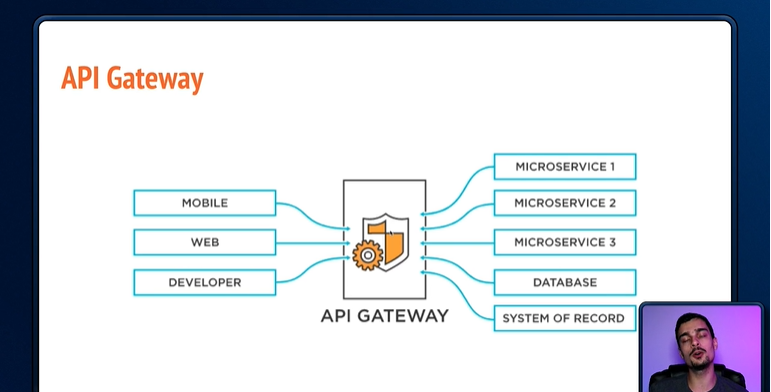
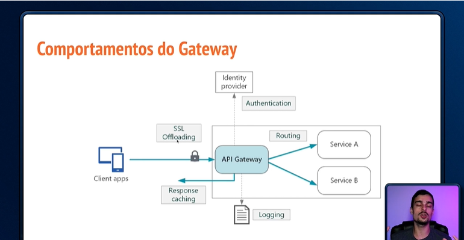
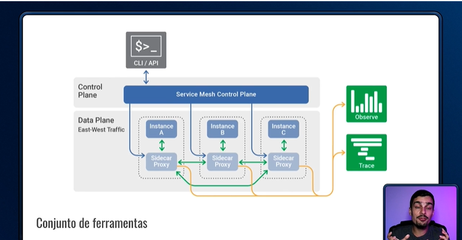

# Tópicos sobre Microserviços

## Conteúdo de artigos e Alura+

### Microserviços

- Monolitos: Aplicações que possuem todas as regras e códigos em um único lugar.

- Microserviços: Trabalha com partes isoladas no sistema (independentes).

### Tipos de Microserviços

- Data Service: Serviço que fornece acesso direto a dados.

- Bussines Service: Aglomerado de data services. Conjunto de regras de negócio.

- Translation Service: Fornece serviços de tradução de dados/informações.

- Edge Service: Permite que forneça algumas especificidades para o cliente.

### API Gateway

- API Gateway é considerada a porta de entrada de uma API

- Ele centraliza o acesso aos vários serviços.

    

- Importante o cuidado com a API Gateway, pois se ele cai, não se conseguirá mais ter acesso com os serviços.

- Comportamentos da API Gateway:

    

### Service Mesh (Malha de Serviços)

- Uma malha de serviços é um termo relativo à infraestrutura de comunicaçõa existente entre vários serviços que compõem uma determinada aplicação/solução.

    

## Conteúdo dos módulos de treinamento

### Microserviços: Padrões de projeto

#### 1.0 Conhecendo a arquitetura