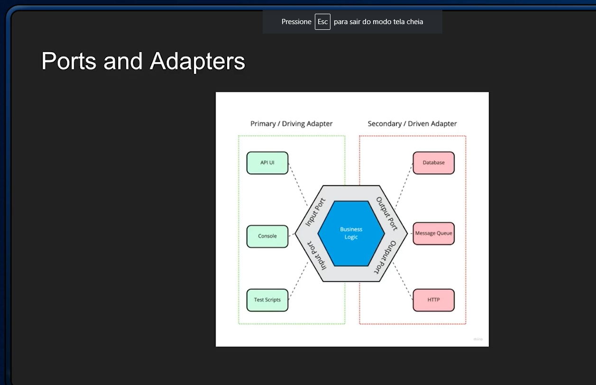

# Tópicos

## Design de código x arquitetura de software

- Definição de arquitetura de software: Visão de mais alto nível. Separação de camadas, pastas da aplicação.

- Definição de design de código: Visão de mais baixo nível. Como escrever cada classe. Quais padrões aplicar (DDD, SOLID, KISS, DRY).

## Clean Architecture

- O que é arquitetura de software? É a definição dos componentes, suas propriedades externas e seus relacionamentos com outros softwares.

- Um modelo de organização é o MVC (MODEL, VIEW e CONTROLLER).

- Clean Architecture:

    

## Arquitetura hexagonal

- Ports and Adapters ou Arquitetura Hexagonal tem a ideia de isolar toda a regra de negócio.

- Arquitetura hexagonal:

    